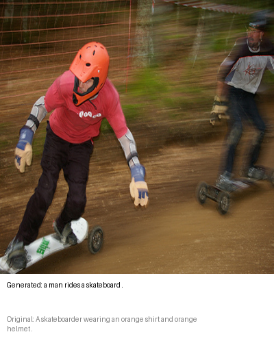
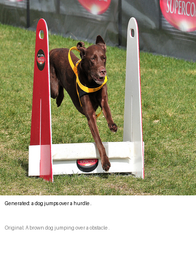
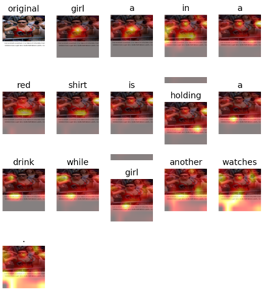

# Neural Image Captioning: Automated Description Generation from Visual Data

**NC State AI Student Symposium 2026**  
**ECE / CSC 525 | Team 109**

**Team Members:** Kunal Jindal, Suyesh Jadhav, Karthik Suresh

---

## Problem Statement

Image captioning sits at the intersection of **Computer Vision (CV)** and **Natural Language Processing (NLP)**. The goal is not only to detect objects in an image, but also to understand visual context, spatial relationships, and scene-level semantics well enough to generate a natural-language description.

### Key Goals

- Understand visual content beyond simple object detection.
- Capture relationships between objects, actions, and scene context.
- Train a deep learning model that can automatically generate descriptive captions for unseen images.

---

## Dataset

We used the **Flickr8k** dataset for training and evaluation.

| Component | Description |
|---|---|
| Dataset | Flickr8k |
| Total Images | 8,091 |
| Captions per Image | 5 human-written captions |
| Total Captions | ~40,000 |
| Task | Generate natural-language captions from images |

### Preprocessing

- Tokenized captions using `punkt`.
- Added special sequence tokens: `<start>` and `<end>`.
- Resized and center-cropped images.
- Prepared image-caption pairs for supervised sequence generation.

---

## Approach

Our system uses an **Encoder-Decoder architecture** to translate image pixels into natural-language text.

### Encoder: Vision Module

The encoder uses a **Convolutional Neural Network (CNN)** to extract high-level visual features from the input image.

- Backbone: **ResNet-50**
- Purpose: Convert an image into meaningful visual feature representations.
- Output: Spatial feature vectors used by the decoder.

### Decoder: Language Module

The decoder uses an **LSTM** with a **Soft Attention mechanism** to generate captions word by word.

- Model: LSTM decoder
- Attention: Soft attention over image feature regions
- Decoding Strategy: Beam Search with `k = 5`

### Training Objective

The model was trained to minimize **cross-entropy loss** over generated word sequences.

- Loss Function: Cross-Entropy Loss
- Training Duration: 20 epochs

---

## Network Architecture

The model was implemented in **PyTorch** and trained on GPU hardware.

| Component | Details |
|---|---|
| Framework | PyTorch `v2.10.0+cu128` |
| GPU | Tesla T4 |
| Encoder | ResNet-50 CNN |
| Decoder | LSTM with Soft Attention |
| Decoding | Beam Search, `k = 5` |
| Training Objective | Cross-Entropy Loss |

### Architecture Flow

```text
Raw Image
   ↓
ResNet-50 CNN Encoder
   ↓
Spatial Visual Feature Map
   ↓
Soft Attention Mechanism
   ↓
LSTM Decoder
   ↓
Sequential Word Prediction
   ↓
Generated Caption
```

---

## Evaluation Plan and Results

To evaluate the effectiveness of our architectural improvements, we compared our final attention-based model against an early standard Encoder-Decoder baseline on the Flickr8k dataset.

The main goal of the ablation study was to isolate the impact of:

- Soft Attention
- Beam Search decoding
- Improved spatial context preservation during caption generation

---

## Ablation Study: Baseline vs. Attention

The baseline model used a vanilla Encoder-Decoder architecture with a CNN encoder and LSTM decoder. Our final model added a **Soft Attention mechanism** and used **Beam Search** to improve caption quality.

### Results

| Model | Architecture | BLEU-1 | BLEU-4 |
|---|---|---:|---:|
| Baseline | ResNet-101 + LSTM | 0.4180 | 0.0780 |
| Ours | ResNet-50 + LSTM + Attention + Beam Search | **0.6717** | **0.2313** |

### Key Finding

The introduction of **Soft Attention** helped the LSTM maintain spatial context across timesteps, while **Beam Search** improved the quality of generated word sequences. Together, these changes produced a significant performance improvement over the vanilla baseline.

---

## Qualitative Results

| Skateboarder Sample | Dog Hurdle Sample |
|---|---|
|  |  |

**Figure 1:** Unseen test samples evaluated using Beam Search with `k = 5`, demonstrating strong semantic understanding.

---

## Attention Visualization



**Figure 2:** Attention visualization using alpha weights. The heatmap shows that the model successfully localizes relevant visual regions, such as the subject wearing a red shirt, within the ResNet-50 feature map during sequential token generation.

---

## Main References

1. **MS-COCO Dataset**  
   https://cocodataset.org

2. **Flickr8k Dataset**  
   https://github.com/jbrownlee/Datasets/releases/tag/Flickr8k

3. **Xu et al. — Show, Attend and Tell: Neural Image Caption Generation with Visual Attention**  
   ICML 2015  
   https://arxiv.org/abs/1502.03044
